**Application Using Main Window**
==============================

### Create a MainWindow based application using the designer.


* [Introduction](##Introduction)<br>

* [SpreadSheet](##SpreadSheet)<br>

* [Text Editor](##Text-Editor)<br>

* [Conclusion](##Conclusion)<br>

--------

## Intoduction


<br>


<p>The QMainWindow main window provides users with an application framework, which has its own layout, and controls can be added to the layout.
<br>
The window can include a menu bar, tool bar, status bar, title bar, etc. The most common form of window is also the main window of the GUI program</p>
<br>


<br>

 >In this homework , we will create two MainWindow using Qt. The first main window is **SpreadSheet** which is something like an excel sheet , the second is a **Text Editor** which is a simple program built around **QPlainText**. 

 <br>
 
 --------------
 
 ## SpreadSheet


In this part we are going to create a spreadsheet with some fonctionnalities using Qt.
  <br>

This application will contain this following components :

* Menu Bar
* Two tools bars
* Status bar to print the informations
<br>

And it will look like that :

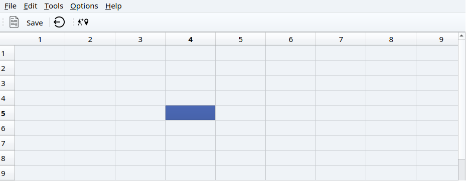
<br>

So we will create a class called **SpreadSheet**  who implements this five main functions :
<p>

*  **createMenus()** 
*   **setupMainWidget()**
*  **createToolBars()**
 * **createActions()** 
  * **makeConnexions()**
  * **aboutt()**
  * **aboutQt()**

with this six customer slots:
*  **close()**
*  **updateStatusBar(int, int)**
*  **goCellSlot()**
*  **saveslot()**
*  **findCell()**
*  **openfile()**
*  **Save(QString filename)**
*  **loadcontent(QString filename)**

and that inherits from this classes :
* **QMainWindow :**  provides a framework for building an application's user interface.
* **QTableWidget :**   Creates a new table view with the given parent.
* **QAction :**  Constructs an action with parent.
* **QMenu :**   Constructs a menu with a title and a parent.
* **QToolBar :**   Constructs a QToolBar with the given parent.
* **QLabel :**   is used for displaying text or an image.
* **QStatusBar :**   provides a horizontal bar suitable for presenting status information.
* **QPixmap :**  provides an off-screen representation of an image. 
* **QMessageBox :**  Constructs a message box with no text and no buttons. 
* **QApplication :**   manages the GUI application’s control flow and main settings. 

Also we need to add two other classes :
* **GoDialog (Cell location)**
* **Find**
</p>
<br>

----------
## Go Cell

Now we will add the function for the goCell action. For that, we need to create a **Dialog** for the user to select a cell using the designer :
<br>

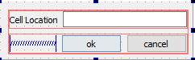

<br>

Then we are going to create the class **godialog.cpp** to set the regular expression validator for the lineEdit and a public Getter for this last to get the cell address.
<br>


-----------
## godialog.h 

<br>


```JavaScript

#ifndef GODIALOG_H
#define GODIALOG_H

#include <QDialog>

namespace Ui {
class GoDialog;
}

class GoDialog : public QDialog
{
    Q_OBJECT

public:
    explicit GoDialog(QWidget *parent = nullptr);
    ~GoDialog();
 QString getText()const;
private:
    Ui::GoDialog *ui;
};

#endif // GODIALOG_H

```

--------
## godialog.cpp

```javascript

#include<QRegExpValidator>
GoDialog::GoDialog(QWidget *parent) :
    QDialog(parent),
    ui(new Ui::GoDialog)
{

    ui->setupUi(this);
    //Validating the regular expression
     QRegExp regCell{"[A-Z][1-9][0-9]{0,2}"};

     //Validating the regular expression
     ui->lineEdit->setValidator(new QRegExpValidator(regCell));

}
QString GoDialog::getText()const
{
    return ui->lineEdit->text();
}

GoDialog::~GoDialog()
{
    delete ui;
}

```
<br>

------------------

When we implement the spreadsheet class we will get this output :

<br>

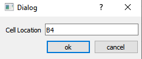

<br>


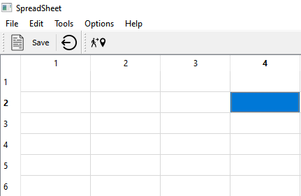

<br>


--------

## Find

Here we will implement the **find** fonctionality, so we need to create the following dialog using Qt designer :

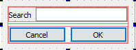 
<br>

 Then we will create the class **finddialog**
 <br>

 ------
 ## finddialog.h
 
 ```javascript
 #ifndef FINDDIALOG_H
#define FINDDIALOG_H

#include <QDialog>

namespace Ui {
class finddialog;
}

class finddialog : public QDialog
{
    Q_OBJECT

public:
    explicit finddialog(QWidget *parent = nullptr);
    ~finddialog();
     QString getText()const;

private:
    Ui::finddialog *ui;
};

#endif // FINDDIALOG_H
 ```
<br>


 -----------

 ## finddialog.cpp

 ```javascript
#include "finddialog.h"
#include "ui_finddialog.h"
#include<QRegExp>
#include<QRegExpValidator>
finddialog::finddialog(QWidget *parent) :
    QDialog(parent),
    ui(new Ui::finddialog)
{
    ui->setupUi(this);

}
QString finddialog::getText()const
{
    return ui->lineedit2->text();
}


finddialog::~finddialog()
{
    delete ui;
}

 ```
<br>

the output looks like this :
<br>

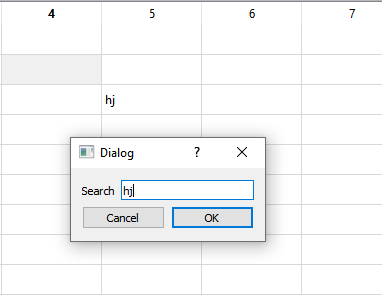

<br>


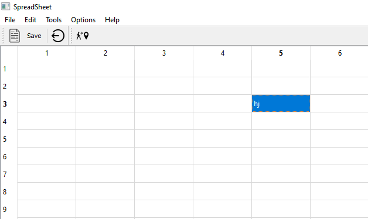

<br>

> Now this is the declaration and implementation of our main class **spreadsheet**
<br>

-------------

## SpreadSheet.h

```javascript
#ifndef SPREADSHEET_H
#define SPREADSHEET_H
#include <QAction>
#include <QMainWindow>
#include <QMenu>
#include <QToolBar>
#include <QTableWidget>
#include <QStatusBar>
#include <QLabel>

class spreadsheet : public QMainWindow
{
    Q_OBJECT

public:
    spreadsheet(QWidget *parent = nullptr);
    ~spreadsheet();

    //------------our methods-------------------

protected :
void createActions(); //fonction pour creer les actions;
void createMenus(); //creer les menus
//void closeEvent(QCloseEvent *e)override;
void setupmainwidget();
void createToolBars();
void makeConnexions();
void aboutt();
void aboutQt();

     //------------our slots-----------------------

private slots :
    void aboutslot();
    void close();
    void updatestatusbar(int,int);//respond for the call changed
    void goCellSlot();
    void savesslot();
    void findCell();
    void openfile();

private :
    void Save(QString filename);//save the content
    void loadcontent(QString filename);

    //-------------pointers------------------------

private:
    //-------------central widgets-----------------
QTableWidget *spredsheet;

    //-------------Actions-------------------------
//le 1 er menu
QAction *newFile; //Action to open a new file
QAction *open;
QAction *save;
QAction *save_as;
QAction *exit;  //Operation close
QAction *populationSp;
QAction *Report_2006_sp;


//le 2 eme menu
QAction *cut;
QAction *copy;
QAction *past;
QAction * Delete;
QAction *row;
QAction *column;
QAction *all;
QAction *find;
QAction *Go_To_cell;

//le 3 eme menu
QAction *recalculate;
QAction *sort;

//le 4 eme
QAction *show_grid;
QAction *auto_recalculate;

//le 5 eeme;
QAction *about;        //About the application
QAction *about_Qt;


//----------------Menus----------------------------

//definir tous menus
QMenu * filemenu ;
QMenu *editMenu;
QMenu *toolsMenu;
QMenu *optionsMenu;
QMenu * helpMenu ;// grouper ttes actions pour manpuler un fichier

//-----------------Widget pour status bar----------
QLabel *cellLocation;//pos of the active cell
QLabel * cellFormula;//formule of the active cell
//name of the file
QString * currentfile=nullptr;
};
#endif // SPREADSHEET_H

```
------------------

## SpreadSheet.cpp


```javascript

#include "spreadsheet.h"
#include <QAction>
#include <QPixmap>
#include <godialog.h>
#include <finddialog.h>
#include <QApplication>
#include <QMenuBar>
#include <QToolBar>
#include <QFileDialog>
#include <QTextStream>
#include <QMessageBox>
spreadsheet::spreadsheet(QWidget *parent)
    : QMainWindow(parent)
{

    createMenus();//creating menus
    setupmainwidget();//setting the spreadsheet
    createActions();//creating actions
    createToolBars();//creating tool bar
    makeConnexions();//making the connexions

    //creating the labeks for the status bar
    cellLocation = new QLabel("(1, 1)");
    cellFormula = new QLabel("");
    statusBar()->addPermanentWidget(cellLocation);
    statusBar()->addPermanentWidget(cellFormula);
     //statusBar()->showMessage("setting up the app",2000);
    //initite the name of the file
        currentfile = nullptr;
        //add the name of the file
        setWindowTitle("Buffer");
}
void spreadsheet::setupmainwidget(){
    spredsheet = new QTableWidget;
    spredsheet->setRowCount(100);
    spredsheet->setColumnCount(10);
    setCentralWidget(spredsheet);
}

spreadsheet::~spreadsheet()
{
    delete spredsheet;

    //--------actions---------

 //delete spredsheet;
 delete newFile;
 delete open;
 delete save;
 delete save_as;
 delete exit;
 delete populationSp;
 delete Report_2006_sp;

    //-------le 2 eme menu-----
 delete cut;
 delete copy;
 delete past;
 delete  Delete;
 delete row;
 delete column;
 delete all;
 delete find;
 delete Go_To_cell;

    //-----le 3 eme menu----
 delete recalculate;
 delete sort;

    //---------le 4 eme----
 delete show_grid;
 delete auto_recalculate;

    //-----le 5 eeme------
 delete about;
 delete about_Qt;

    //-------menus---------------
    delete filemenu;
    delete editMenu;
    delete toolsMenu;
    delete optionsMenu;
    delete helpMenu;
}

void spreadsheet :: createActions(){
//-------etape pour creer une action----

    //1.lui choisir une icone :
    QPixmap quitIcon(":/quit_icon");

    //2.creer l'action
    exit= new QAction(quitIcon,"&Quit",this);
   //3. lui choisir un shortcut
    exit->setShortcut(tr("Ctrl+Q"));
    //4.lui connecter a son slot
    connect(exit, &QAction::triggered,
       qApp, &QApplication::exit);

    //---------new file--------------------
    QPixmap newfileIcon(":/new_file.png");
    newFile = new QAction(newfileIcon,"new file",this);
    newFile->setShortcut(tr("Ctrl+N"));

    //----------open-----------------------
    open = new QAction("&Open",this);
    open ->setShortcut(tr("Ctrl+o"));

    //----------save_as--------------------
    QPixmap saveIcon(":/save_file.png");
    save_as = new QAction(saveIcon,"&Save as",this);

    //----------save-----------------------
    save = new QAction("&save",this);
    save->setShortcut(tr("Ctrl+S"));

    //---------cut-------------------------
    QPixmap cutIcon(":/cut_icon.png");
    cut = new QAction(cutIcon,"&cut",this);
    cut->setShortcut(tr("Ctrl+X"));

    //---------copy------------------------
    copy = new QAction("&Copy",this);
    copy->setShortcut(tr("Ctrl+C"));

    //---------paste-----------------------
    past = new QAction("&Past",this);
    past->setShortcut(tr("Ctrl+V"));

    //----------delete---------------------
    Delete = new QAction("&Delete",this);
    Delete->setShortcut(tr("Del"));

    //----------population & report--------
    populationSp = new QAction("&1 population.sp",this);
    Report_2006_sp = new QAction("&2 Report 2006.sp",this);

    //----------find-----------------------
    QPixmap findIcon(":/search_icon.png");
    find = new QAction(findIcon,"&Find...",this);
    find->setShortcut(tr("Ctrl+F"));

    //---------go to cell------------------
    //QPixmap goCellIcon(":/go_to_icon.png");
    Go_To_cell = new QAction("&Go to Cell...",this);
    Go_To_cell->setShortcut(tr("F5"));

    //-----------select-------------------
    row=new QAction("&Row",this);
    column=new QAction("&Column",this);
    all=new QAction("&All",this);
    all->setShortcut(tr("Ctrl+A"));

    //-----------recalculate--------------
    recalculate =new QAction("&Recalculate",this);
    recalculate->setShortcut(tr("F9"));

    //------------sort-------------------
    sort =new QAction("&Sort...",this);

    //------------show grid--------------
    show_grid = new QAction("&Show Grid");
    show_grid ->setCheckable(true);
    show_grid ->setChecked(spredsheet->showGrid());


    //------------auto recalculate-------
    auto_recalculate = new QAction("&Auto-recalculate");
    auto_recalculate->setCheckable(true);
    auto_recalculate->setChecked(true);

    //------------about & about qt-------
   about = new QAction("&About",this);
   about->setShortcut(tr("Ctrl+?"));
   connect(about,&QAction::triggered,this,&spreadsheet::aboutslot);
   about_Qt = new QAction("About &Qt");


}
void spreadsheet::close()
{

    auto reply = QMessageBox::question(this, "Exit",
                                       "Do you really want to quit?");
    if(reply == QMessageBox::Yes)
        qApp->exit();
}
void spreadsheet :: createMenus(){

    //-----------file menu-----------------
filemenu = menuBar()->addMenu("&File");
filemenu -> addAction(newFile);
filemenu->addAction(open);
filemenu -> addAction(save);
filemenu->addAction(save_as);
filemenu->addSeparator();
filemenu -> addAction(populationSp);
filemenu -> addAction(Report_2006_sp);
filemenu->addSeparator();
filemenu -> addAction(exit);

//-----------------edit menu--------------------
editMenu = menuBar()->addMenu("&Edit");
editMenu->addAction(cut);
editMenu->addAction(copy);
editMenu->addAction(past);
editMenu->addAction(Delete);
editMenu->addSeparator();
auto select = editMenu->addMenu("&Select");
select->addAction(row);
select->addAction(column);
select->addAction(all);
editMenu->addSeparator();
editMenu->addAction(find);
editMenu->addAction(Go_To_cell);

//------------------tools menu-----------------
toolsMenu = menuBar()->addMenu("&Tools");
toolsMenu->addAction(recalculate);
toolsMenu->addAction(sort);

//----------------Options menus----------------
optionsMenu = menuBar()->addMenu("&options");
optionsMenu->addAction(show_grid);
optionsMenu->addAction(auto_recalculate);

//---------------help menus-------------------
helpMenu = menuBar()->addMenu("&Help");
helpMenu->addAction(about);
helpMenu->addAction(about_Qt);

}
void spreadsheet::aboutslot(){
QMessageBox :: about(this,"about","my humnle spreadsheet appl made by CS");
};

//void spreadsheet:: closeEvent(QCloseEvent *e){
//auto reply = QMessageBox::question(this,"Exit","are you sure:");
//if(reply==QMessageBox::Yes)
//    qApp->exit();
//}
void spreadsheet::createToolBars()
{

    //Creer une bare d'outils
    auto toolbar1 = addToolBar("File");

    //Ajouter des actions acette bar
    toolbar1->addAction(newFile);
    toolbar1->addAction(save);
    toolbar1->addSeparator();
    toolbar1->addAction(exit);

    //Creer une autre tool bar
    auto toolbar2  = addToolBar("ToolS");
    toolbar2->addAction(Go_To_cell);
}
//update the status bar according to the choice
void spreadsheet::updatestatusbar(int row, int col){
    //cellLocation=new QLabel("A4");
   //cellFormula=new QLabel("A4+B5");
    QString cell{"(%0, %1)"};
   cellLocation->setText(cell.arg(row+1).arg(col+1));
}
void spreadsheet::makeConnexions()
{

   // --------- Connexion for the  select all action ----/
   connect(all, &QAction::triggered,
           spredsheet, &QTableWidget::selectAll);

   // Connection for the  show grid
   connect(show_grid, &QAction::triggered,
           spredsheet, &QTableWidget::setShowGrid);

   //Connection for the exit button
   connect(exit, &QAction::triggered, this, &spreadsheet::close);


   //connectting the chane of any element in the spreadsheet with the update status bar
   connect(spredsheet, &QTableWidget::cellClicked, this,  &spreadsheet::updatestatusbar);

   //Connextion between the gocell action and the gocell slot
      connect(Go_To_cell, &QAction::triggered, this, &spreadsheet::goCellSlot);

      connect(find, &QAction::triggered, this, &spreadsheet::findCell);

      connect(save, &QAction::triggered, this, &spreadsheet:: savesslot);
      //connect(saveAs, &QAction::triggered, this , &SpreadSheet::saveasslot);
     connect(open, &QAction::triggered, this, &spreadsheet::openfile);

     connect(about_Qt,&QAction::triggered,this,&spreadsheet::aboutQt);

     connect(about,&QAction::triggered,this,&spreadsheet::aboutt);
}
void spreadsheet::aboutt()
{
   QMessageBox::about(this, tr("About Application"),
            tr("The <b>Application</b> example demonstrates how to "
               "write modern GUI applications using Qt, with a menu bar, "
               "toolbars, and a status bar."));
}
void spreadsheet::aboutQt(){
    QMessageBox::aboutQt(this,"Qt installation");
}
void spreadsheet::openfile(){

    if(!currentfile)
      {
        QFileDialog D;
  //  auto d=   D.getExistingDirectory();
    auto file=D.getOpenFileName();
        //function that save the content
        loadcontent(file);

}}
void spreadsheet::loadcontent(QString filename){
    //open the pointer on the file
    QFile file(filename);
    if(file.open(QIODevice::ReadOnly))
    {
        QTextStream in (&file);
        //run throught all the file
        while(!in.atEnd()){
            QString line;
            line = in.readLine();
            //separate the lignes with a comma
            auto tokens = line.split(QChar(','));
            //row
            int row= tokens[0].toInt();
            int col = tokens[1].toInt();
           auto cell= new QTableWidgetItem(tokens[2]);
           spredsheet->setItem(row,col,cell);
        }}
    file.close();}
void spreadsheet::savesslot(){
//verifey if we have a name of the file
if(!currentfile)
  {
    QFileDialog D;
    auto filename = D.getSaveFileName();
    //change the file name
    currentfile= new QString(filename);
    //change the title
    setWindowTitle(*currentfile);}
    //function that save the content
    Save(*currentfile);

}
void spreadsheet::Save(QString filename){
    //pointer on the file
    QFile file(filename);
    //open the file on read mode
    if(file.open(QIODevice::WriteOnly))
    {
        QTextStream out(&file);
        //loop that save the contents
        for(int i=0;i<spredsheet->rowCount();i++){
            for(int j=0; j<spredsheet->columnCount();j++){
                auto cell= spredsheet->item(i,j);
        if(cell){
            out << i << ","  << j << "," << cell->text() << endl;
        }}
        }}     file.close();
        }
//the slot of the cell function
void spreadsheet::findCell(){
    finddialog D;
auto reply= D.exec();
if(reply ==QDialog ::Accepted){

auto pattern =D.getText();
//a loop to pass throught all the cell
for( int i= 0; i<spredsheet->rowCount(); i++){

    for(int j=0; j < spredsheet->columnCount(); j++){
        auto cell= spredsheet->item(i, j);
        if(cell )
         if(cell->text().contains(pattern)){

             spredsheet->setCurrentCell(i, j);
             return ;
         }}}}}

void spreadsheet::goCellSlot()
 {
     //Creating the dialog
     GoDialog D;

     //Executing the dialog and storing the user response
     auto reply = D.exec();

     //Checking if the dialog is accepted
     if(reply == GoDialog::Accepted)
     {
         //Getting the cell text
                  auto text = D.getText();

                  //letter distance
                  int row = text[0].toLatin1() - 'A';
                  text = text.remove(0,1);

                  //second coordinate
                  int col =  text.toInt()-1;

                  spredsheet->setCurrentCell(row,col);


                  //changing the current cell
                  spredsheet->setCurrentCell(row, col);

     }}

```

----

## Main.cpp

```javascript

#include "spreadsheet.h"

#include <QApplication>

int main(int argc, char *argv[])
{
    QApplication a(argc, argv);
    spreadsheet w;
    w.show();
    return a.exec();
}

```

----

## The Output


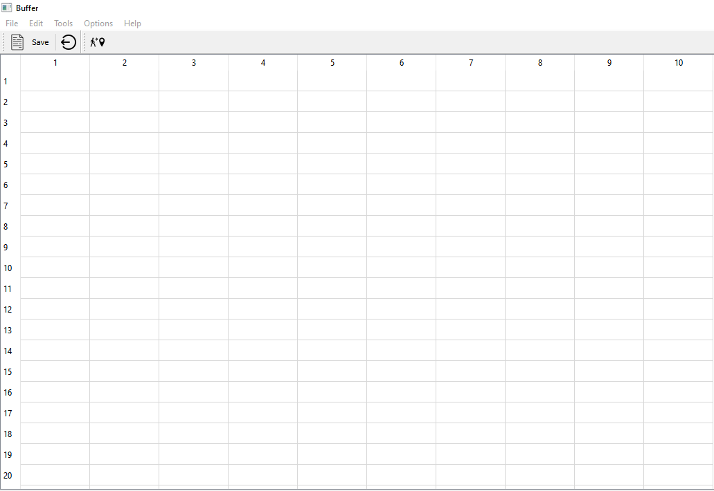

<br>

> show grid functionality

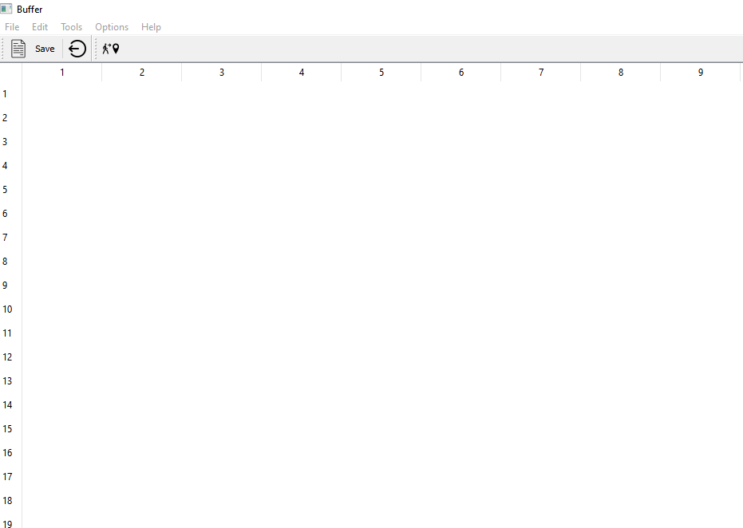

<br>

> open functionality

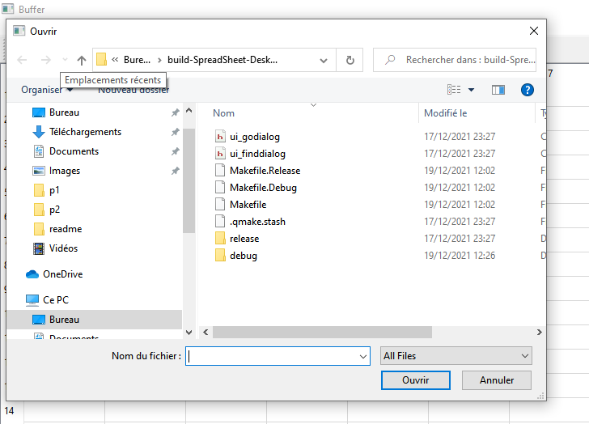

<br>

>save functionality

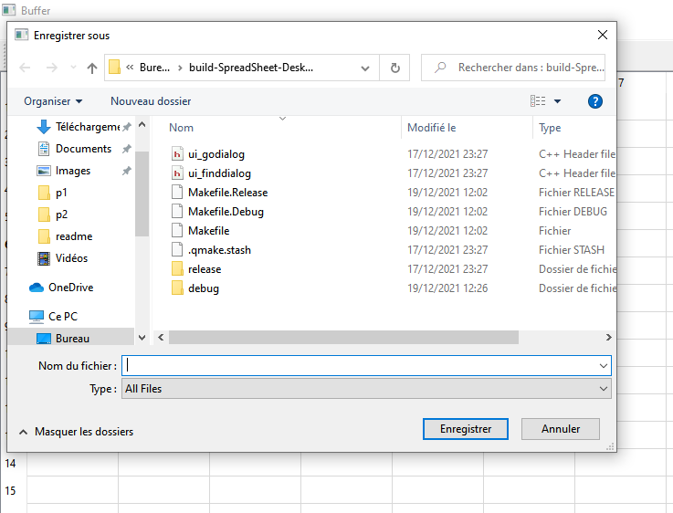

<br>

-------------
## Text Editor

For this test, we will playing the Designer for a fast application creation. The application  is a simple text editor program built around QPlainText.
<br>

 So we will create this application with it's fonctionnalities as the following :
 <br>

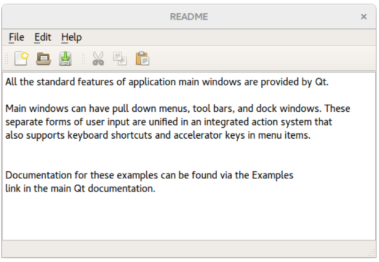
<br>

we create a class called **texteditor** to implement this main methods :

* **createActions():** to create the actions
* **createMenus():** to create the menus
* **createToolBars():** to create the toolbars
* **makeConnexions():** to make the connexions between the elements

<br>

---------

## Texteditor.h

<br>

```javascript
#ifndef TEXTEDITOR_H
#define TEXTEDITOR_H

#include <QMainWindow>
#include <QTableWidget>
#include <QAction>
#include <QMenu>
#include <QToolBar>
#include <QLabel>
#include <QStatusBar>
#include <QPlainTextEdit>


class texteditor : public QMainWindow
{
    Q_OBJECT

public:
    texteditor();
    ~texteditor();
protected:
    void createActions();//create the actions
    void createMenus();//create the menus
    void createToolBars();//create the toolbars
    void makeConnexions();//make the connexions between the elements
private slots:
    void close();
    void savesslot();
    void openfile();
    void document_Was_Modified();
    void about();
    void abouttQt();
    void save_as();
    void copy_slot();
    void paste_slot();
    void cut_slot();
private:
void Save(QString filename);
void loadcontent(QString filename);
void saveFile(const QString &fileName);
private:
    // --------------- Central Widget -------------//
    QTableWidget *spreadsheet;

    // --------------- Actions       --------------//
    QAction * newFile;
    QAction * open;
    QAction * save;
    QAction * saveAs;
    QAction * exit;
    QAction *cut;
    QAction *copy;
    QAction *paste;
    QAction *aboutt;
    QAction *about_Qt;


    // ---------- Menus ----------
    QMenu *FileMenu;
    QMenu *editMenu;
    QMenu *toolsMenu;
    QMenu *optionsMenu;
    QMenu *helpMenu;

    //--------------- text edit -----------------
 QPlainTextEdit *textEdit;
 //--------------- current file  -----------------
 QString * currentfile=nullptr;


};
#endif // TEXTEDITOR_H

```

----------------

## Texteditor.cpp

<br>

```javascript
#include "texteditor.h"
#include <QPixmap>
#include <QMenuBar>
#include <QToolBar>
#include <QApplication>
#include <QMessageBox>
#include <QFileDialog>
#include <QTextStream>
texteditor::texteditor()
     : textEdit(new QPlainTextEdit)
{
    //setupMainWidget();
 setCentralWidget(textEdit);
    // Creaeting Actions
    createActions();

    // Creating Menus
    createMenus();


    //Creating the tool bar
    createToolBars();

    //making the connexions
    makeConnexions();

    //initier le nom du fichier
    currentfile = nullptr;
    //mettre le nom du spreadshet
    setWindowTitle("Buffer");

    //----------------------------------

}

texteditor::~texteditor()
{
    delete spreadsheet;

    // --------------- Actions       --------------//
    delete  newFile;
    delete  open;
    delete  save;
    delete  saveAs;
    delete  exit;
    delete cut;
    delete copy;
    delete paste;
    delete aboutt;
    delete about_Qt;


    // ---------- Menus ----------
    delete FileMenu;
    delete editMenu;
    delete toolsMenu;
    delete optionsMenu;
    delete helpMenu;
}
void texteditor::createActions(){
    // --------- New File -------------------
   QPixmap newIcon(":/new_file.png");
   newFile = new QAction(newIcon, "&New", this);
   newFile->setShortcut(tr("Ctrl+N"));


    // --------- open file -------------------
    QPixmap openIcon(":/open.png");
   open = new QAction(openIcon,"&Open", this);
   open->setShortcut(tr("Ctrl+O"));

    // --------- save file -------------------
    QPixmap saveIcon(":/save_file.png");
   save = new QAction(saveIcon,"&Save", this);
   save->setShortcut(tr("Ctrl+S"));

    // --------- save_as file -------------------
    QPixmap saveasIcon(":/save-file.png");
   saveAs = new QAction(saveasIcon,"save &As", this);


    // --------- cut file -------------------
   QPixmap cutIcon(":/cut.png");
   cut = new QAction(cutIcon, "Cu&t", this);
   cut->setShortcut(tr("Ctrl+X"));

   // --------- Copy -----------------
    QPixmap copyIcon(":/copy.png");
   copy = new QAction( copyIcon,"&Copy", this);
   copy->setShortcut(tr("Ctrl+C"));
  // ---------paste -----------------
    QPixmap pasteIcon(":/paste.png");
   paste = new QAction( pasteIcon,"&Paste", this);
   paste->setShortcut(tr("Ctrl+V"));
   // --------- about -----------------
   QPixmap aboutIcon(":/info.png");
   aboutt =  new QAction(aboutIcon,"&About",this);
   // --------- about_Qt -----------------
   QPixmap qtIcon(":/qt.png");
   about_Qt = new QAction(qtIcon,"About &Qt",this);

    // --------- exit -------------------
   QPixmap exitIcon(":/quit_icon.png");
   exit = new QAction(exitIcon,"E&xit", this);
   exit->setShortcut(tr("Ctrl+Q"));
}
// --------- to close the window -----------------
void texteditor::close()
{

    auto reply = QMessageBox::question(this, "Exit",
                                       "Do you really want to quit?");
    if(reply == QMessageBox::Yes)
        qApp->exit();
}
void texteditor::createMenus()
{
    // --------  File menu -------//
    FileMenu = menuBar()->addMenu("&File");
    FileMenu->addAction(newFile);
    FileMenu->addAction(open);
    FileMenu->addAction(save);
    FileMenu->addAction(saveAs);
    FileMenu->addSeparator();
    FileMenu->addAction(exit);


    //------------- Edit menu --------/
    editMenu = menuBar()->addMenu("&Edit");
    editMenu->addAction(cut);
    editMenu->addAction(copy);
    editMenu->addAction(paste);
    editMenu->addSeparator();

    //----------- Help menu ------------
    helpMenu = menuBar()->addMenu("&Help");
    helpMenu->addAction(aboutt);
    helpMenu->addAction(about_Qt);
}
// --------- create the toolbar and add some elements (newfile-save..) -----------------
void texteditor::createToolBars()
{

    //Crer une bare d'outils
    auto toolbar1 = addToolBar("File");


    //Ajouter des actions acette bar
    toolbar1->addAction(newFile);
    toolbar1->addAction(save);
    toolbar1->addSeparator();
    toolbar1->addAction(exit);
    toolbar1->addAction(copy);

}
void texteditor::makeConnexions(){
    //Connection for the exit button
    connect(exit, &QAction::triggered, this, &texteditor::close);
    //connect the save signal with it's slot
    connect(save, &QAction::triggered, this, &texteditor::savesslot);
    //connect theh open signal with it's slot
   connect(open, &QAction::triggered, this, &texteditor::openfile);
   //connect the textedit with the modification slot
    connect(textEdit->document(), &QTextDocument::contentsChanged,
              this, &texteditor::document_Was_Modified);
       //desable the copy and cut when we don't have a text
       cut->setEnabled(false);
       copy->setEnabled(false);
       //connect the copy and cut with the enable
       connect(textEdit, &QPlainTextEdit::copyAvailable, cut, &QAction::setEnabled);
       connect(textEdit, &QPlainTextEdit::copyAvailable, copy, &QAction::setEnabled);
       //connect the aboutt with it's slot
       connect(aboutt,&QAction::triggered,this,&texteditor::about);
       connect(about_Qt,&QAction::triggered,this,&texteditor::abouttQt);
       //connect the save_as with it's slot
       connect(saveAs,&QAction::triggered,this,&texteditor::save_as);
       //connect the copy with it's slot
       connect(copy,&QAction::triggered,this,&texteditor::copy_slot);
        //connect the paste with it's slot
       connect(paste,&QAction::triggered,this,&texteditor::paste_slot);
        //connect the cut with it's slot
       connect(cut,&QAction::triggered,this,&texteditor::cut_slot);

}
//----------- show the message about qt ------------
void texteditor::abouttQt(){
    QMessageBox::aboutQt(this,"Qt installation");
}
//----------- associate the copy function with the text ------------
void texteditor::copy_slot(){
    textEdit->copy();
}
//----------- associate the paste function with the text  ------------
void texteditor::paste_slot(){
    textEdit->paste();
}
//----------- associate the cut function with the text  ------------
void texteditor::cut_slot(){
    textEdit->cut();
}
//----------- add the modofication of the text with the function ismodified ------------
void texteditor::document_Was_Modified(){
    setWindowModified(textEdit->document()->isModified());

}
//----------- activate the save_as slot with the qfile dialog and the condition ------------
void texteditor::save_as()
    {

    QString filename= QFileDialog::getSaveFileName(this, "Save As");

    if (filename.isEmpty())
        return;

    QFile file(filename);


    //Open the file
    if (!file.open(QIODevice::WriteOnly | QIODevice::Text))
        return;

    QTextStream out(&file);
    file.close();
    }

void texteditor::openfile(){

    if(!currentfile)
      {
        QFileDialog D;
    auto file=D.getOpenFileName();
        //function that save the content of the file
        loadcontent(file);


}}
//----------- the slot that save the content of a file   ------------
void texteditor::loadcontent(QString filename){
    //open the file with the pointer
    QFile file(filename);
    if(file.open(QIODevice::ReadOnly))
    {
        QTextStream in (&file);
        //read all the content of the file
        while(!in.atEnd()){
            QString line;
            line = in.readLine();
            //separate the line with a comma
            auto tokens = line.split(QChar(','));
            //row
            int row= tokens[0].toInt();
            int col = tokens[1].toInt();
           auto cell= new QTableWidgetItem(tokens[2]);
           spreadsheet->setItem(row,col,cell);
        }
    }
//to close the file
    file.close();
}


void texteditor::savesslot(){
//verifiy if we have a name of file
if(!currentfile)
  {
    QFileDialog D;
    auto filename = D.getSaveFileName();
    //change the file name
    currentfile= new QString(filename);
    //changer le titre
    setWindowTitle(*currentfile);}
    //fonction that save the content
    Save(*currentfile);

}
//----------- the message showed by the about slot    ------------
void texteditor::about()
{
   QMessageBox::about(this, tr("About Application"),
            tr("The <b>Application</b> example demonstrates how to "
               "write modern GUI applications using Qt, with a menu bar, "
               "toolbars, and a status bar."));
}
//----------- the slot that save the content of a file   ------------
void texteditor::Save(QString filename){
    //pointer on the file
    QFile file(filename);
    //read only mode
    if(file.open(QIODevice::WriteOnly))
    {
        QTextStream out(&file);
        //save the content with a for loop
        for(int i=0;i<spreadsheet->rowCount();i++){
            for(int j=0; j<spreadsheet->columnCount();j++){
                auto cell= spreadsheet->item(i,j);
        if(cell){
            out << i << ","  << j << "," << cell->text() << endl;
        }}
    }}

    file.close();
}
```
<br>

------------

## Main.cpp

```javascript

#include "texteditor.h"

#include <QApplication>

int main(int argc, char *argv[])
{
    QApplication a(argc, argv);
    texteditor w;
    w.show();
    return a.exec();
}

```

-------

## Output

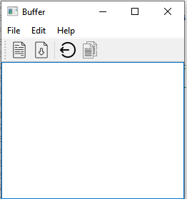

<br>

> To see all functionalities of text editor you can run the code on your Qt

------------------

## Conclusion
<p>
Although this examples are a little bit easy ,they should give us an idea of how easy it is to write GUI applications using Qt. we have explored how to create main windows or custom widgets in Qt. For example, to create a main window complete with menus, toolbars, and a status bar, subclass QMainWindow instead of QDialog and provide a slot for each menu item.
</p>
